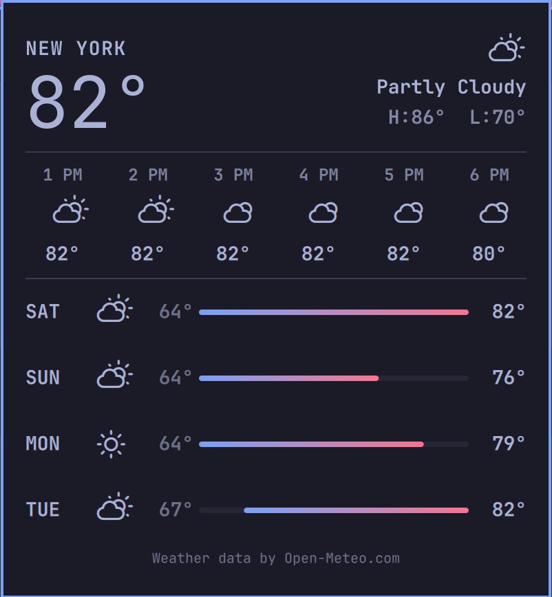

# iWeather



A native Omarchy Quattro bar widget for current conditions, hourly and
five-day forecasts, location search, and U.S. National Weather Service
observations and alerts.

## Features

- Condition icon and temperature in the Omarchy bar
- Current conditions plus hourly and five-day forecasts
- Searchable city and ZIP-code location picker
- Automatic location detection when no location is configured
- National Weather Service observations, forecasts, and active alerts in the
  United States, with Open-Meteo fallback data
- Metric and imperial units without an API key
- Theme-aware Omarchy UI and keyboard-friendly panel

## Requirements

- Omarchy Quattro (Omarchy 4)
- `curl` and `jq`, both included with a standard Omarchy installation
- Network access to `wttr.in`, `api.open-meteo.com`,
  `geocoding-api.open-meteo.com`, and, for U.S. locations,
  `api.weather.gov`

iWeather has no install hook, bundled binary, privileged operation, background
service, account, or API-key requirement.

## Install

```bash
omarchy plugin add https://github.com/alivault/iweather.git --enable
```

The plugin declares itself as a clone of `omarchy.weather`, so enabling it
replaces the built-in weather widget while retaining the existing bar position
and settings.

## Use

- **Left click:** open or close the forecast panel
- **Middle click:** refresh weather data
- **Right click:** switch between imperial and metric units
- **Click the location name:** search for a city or ZIP code
- **Enter:** save the selected location
- **Escape:** cancel location editing or close the panel

The panel also supports Omarchy Shell IPC:

```bash
omarchy-shell shell toggle ali.iweather
```

## Privacy and data

With automatic location enabled, wttr.in derives an approximate city from the
machine's public IP address. Choosing a location stores its name and coordinates
locally in:

```text
~/.local/state/omarchy/settings/weather.json
```

Configured coordinates are sent to wttr.in and Open-Meteo. Coordinates for
U.S. locations are also sent to weather.gov for official observations,
forecasts, and alerts. Search text is sent to Open-Meteo's geocoding API.
iWeather does not transmit credentials or add its own analytics. Open-Meteo
data is adapted for this display under the
[CC BY 4.0 license](https://creativecommons.org/licenses/by/4.0/).

Clear the shared Omarchy weather location with:

```bash
omarchy-weather-location --clear
```

## Remove

```bash
omarchy plugin remove ali.iweather
```

Omarchy disables iWeather before removing it and restores the built-in weather
widget. Removing the plugin does not delete the shared weather location file.

## Development

```bash
./check.sh
omarchy plugin validate .
```

The dependency-free checks use Node's built-in test runner and validate Bash,
JavaScript, and the manifest. `shellcheck` runs when installed.

## License

[MIT](LICENSE). iWeather is derived from Omarchy's built-in weather plugin;
see [THIRD_PARTY_NOTICES.md](THIRD_PARTY_NOTICES.md).
